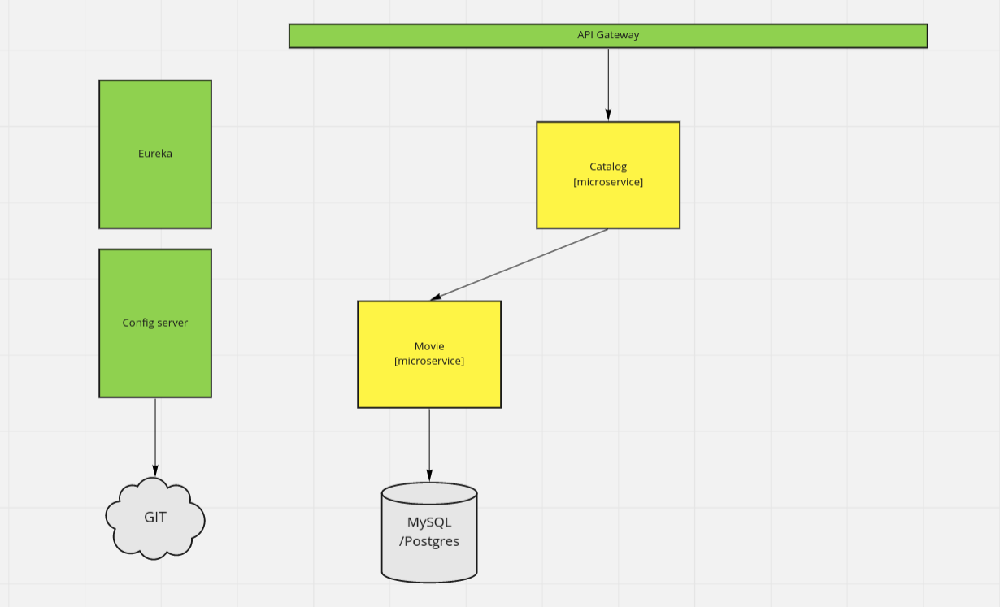

# Avaliação Parcial - Especialização Back-end - Spring Cloud
> A avaliação parcial consiste em contruir uma aplicação baseada na arquitetura
> de microsserviços usando o Spring Cloud, você pode verificar os microsserviços registrados no Eureka Server
> clicando [_aqui._](https://avparcialeurekaserver.azurewebsites.net)

## O problema

A partir da seguinte arquitetura de microsserviços, pedimos que você a implemente usando o Spring Cloud

## Estrutura

- Dois microsserviços: movie-service e catalog-service
- Catalog-service deve consumir dados de movie-service utilizando Feign que por sua vez consome dados de um banco de dados (MySQL foi escolhido pelo aluno)
- Gateway que fará o roteamento para ambos os microsserviços
- Server config obtendo as configurações a partir deste repositório git
- Eureka server para service discovery & service registry

## Endpoints `APIGateway`
> NOTA: Os endpoints abaixo estão rodando na Azure e estão disponíveis para testar.
> Por favor, não abuse dos recursos de criação de filmes :)
- `POST`  - `https://avparcialgateway.azurewebsites.net/movie` para cadastro de filme
- `GET`   - `https://avparcialgateway.azurewebsites.net/movie/{genre}` para trazer filmes por gênero
- `GET`   - `https://avparcialgateway.azurewebsites.net/catalog/{genre}` retorna o catalogo de filmes (no momento) por gênero.